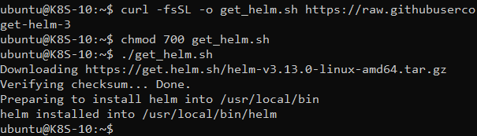
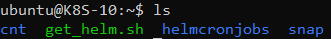
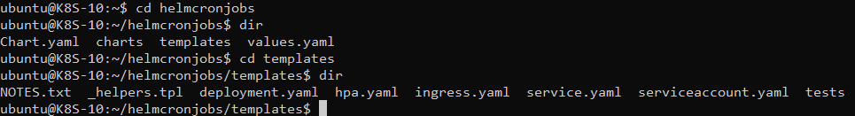
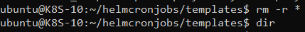
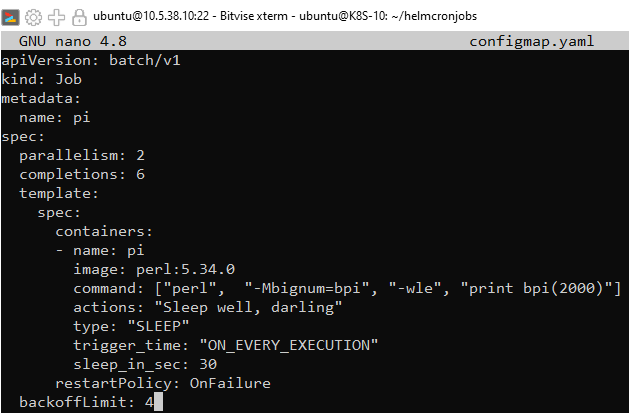
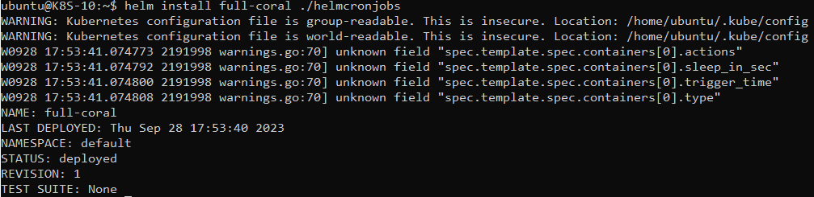
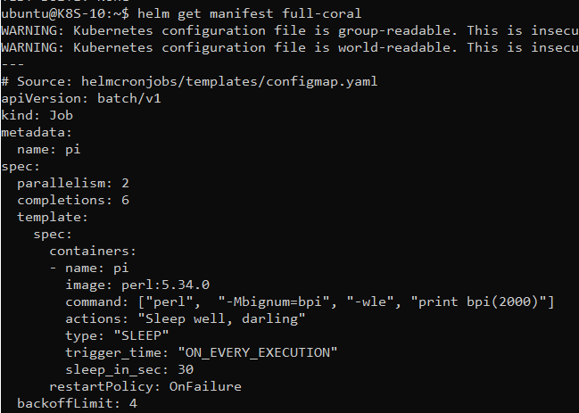

# Aufgabe D - HELM

## Links
- [Link zu den Ressourcen im GitLab](https://gitlab.com/ch-tbz-hf/Stud/v-cnt/-/tree/main/2_Unterrichtsressourcen/A)
- [Link zur Kubernetes-Oberfläche](https://10.5.38.10:8443/#/create?namespace=default)

## Installation HELM

Zuerst müssen wir HELM Installieren mit den folgenden 3 Code Zeilen:
```yaml
- $ curl -fsSL -o get_helm.sh https://raw.githubusercontent.com/helm/helm/main/scripts/get-helm-3
- $ chmod 700 get_helm.sh
- $ ./get_helm.sh
```



Unser eigen erzeugtes HELM Chart basiert aus dem YAML File von der Aufgabe A (CronJobs) (Siehe [Link zu Aufgabe A](https://github.com/pineapplepeewee/V_VNT_Gruppe2/blob/main/A_CronJobs.md))


Somit wurde unser HELM Chart bzw Ordner erstellt und ist auch ersichtlich:



Anschliessend wird im HELM Chart zugegriffen und geht in den Ordner „templates“, um die darin erstellten Dateien gelöscht:
- _NOTES.txt
- helpers.tpl
- hpa_yaml
- ingress.yaml
- service.yaml
- serviceaccount.yaml
- tests



Zum löschen der Dateien im Ordner wird der Befehl „rm -r *“ verwendet



Jetzt erstellen wir unsere eigene Datei mit dem Namen "configmap.yaml". Das YAML erstellt einene Job mit dem Namen "pi"



Im Ordner „templates“ ist nun unsere erstellte Datei vorhanden:


Nun haben wir ein installierbares Chart und können es installieren:
```yaml
helm install full-coral ./helmcronjobs
```



Mit dem folgenden Code kann das Template veranschaulicht werden (bzw unser YAML File):
```yaml
helm get manifest full-coral
```



Nun können wir das erstellte HELM wieder deinstallieren:
```yaml
helm uninstall full-coral
```
 